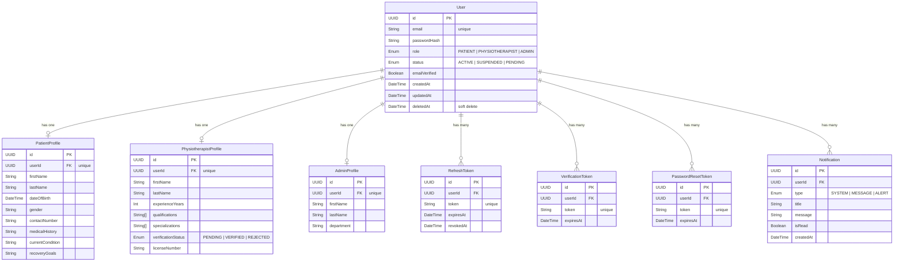
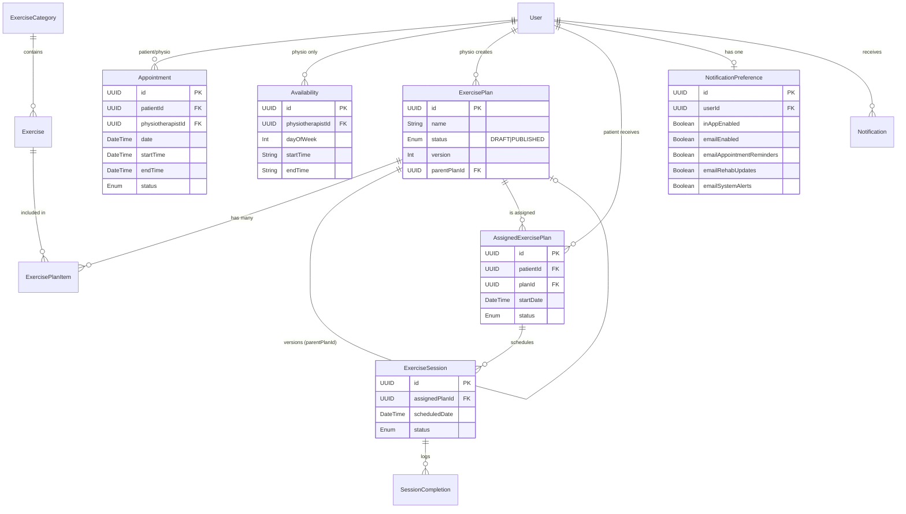

# MOVA Database Architecture

## Entity Relationship Diagram (ERD)

The MOVA platform utilizes a normalized PostgreSQL database, structured via Prisma ORM. 
It supports multiple user roles (Patient, Physiotherapist, Admin) using a centralized identity model (`User`) linked to specific profile models. Tokens and notifications are isolated in dedicated tables.

## Schema Highlights

- **Soft Delete**: All critical tables have a `deletedAt` DateTime field. Queries should inherently filter `where: { deletedAt: null }`.
- **Cascading Rules**: All relations to `User` feature `onDelete: Cascade`. Hard deleting a user automatically removes their profile, tokens, and notifications.
- **UUIDs**: All primary keys are UUIDs, improving security (preventing enumeration attacks) and scalability.
- **Transactions**: Core workflows, such as User Registration, wrap Profile and VerificationToken creations inside `$transaction` blocks to ensure atomic data integrity.

## Appointment & Rehabilitation Models

